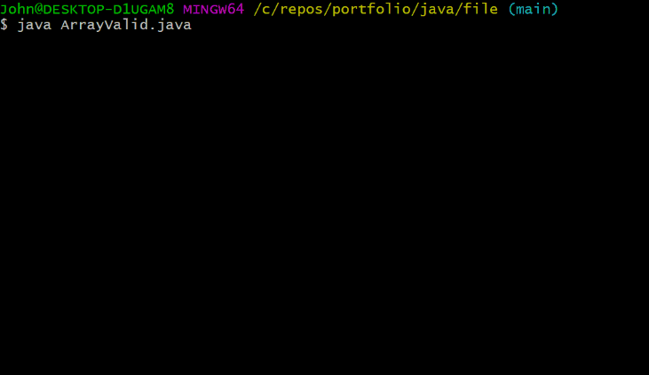

# Java Skillsets

###Array & Data Validation



``` java
/*  
    This program will ask user to input the length and elements
    of an array,validate for correct user input data, and return
    each element of the array, the sum of the values, and the average.
*/

import java.util.Scanner;
public class ArrayValid
{
    public static void main(String[] args)
    {
        Scanner scan = new Scanner(System.in);
        int size = 0;
        boolean dataValid = false; //data varification verriable
        
        //get array size from user
        while (dataValid == false)
        {
            //validate user input for valid data
            try
            {
                System.out.print("Please enter array size: ");
                size = scan.nextInt();
                dataValid = true;
            }
            //catch invalid input
            catch (Exception e)
            {
                scan.nextLine();
                System.out.print("Not valid integer!\n\nPlease Try again. ");
            }
        }

        float[] nums = new float[size]; //initialize float array

        //loop for array length
        for(int i=0; i<size; i++)
        {
            dataValid = false; //initialize varification verriable to false
            
            //get array values for each element
            while (dataValid == false)
            {
                //validate user input for valid data
                try
                {
                    System.out.print("Enter num " + (i+1) + ":  ");
                    nums[i] = scan.nextFloat();
                    dataValid = true;
                }
                //catch invalid input
                catch (Exception e)
                {
                    scan.nextLine();
                    System.out.print("\nNot valid number! ");
                }
            }
        }

        //print values of array
        System.out.print("\nNumbers entered: ");
        float sum = 0;
        for(int i=0; i<size; i++)
        {
            System.out.print(nums[i] + " ");    //print each element
            sum += nums[i];                     //add each value
        }

        //print average
        System.out.print("\nSum: " + sum + "\nAverage: " + sum/size);
    }    
}

```